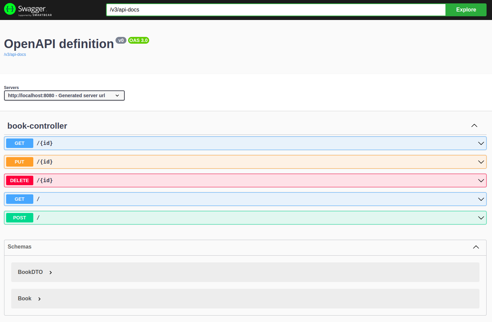
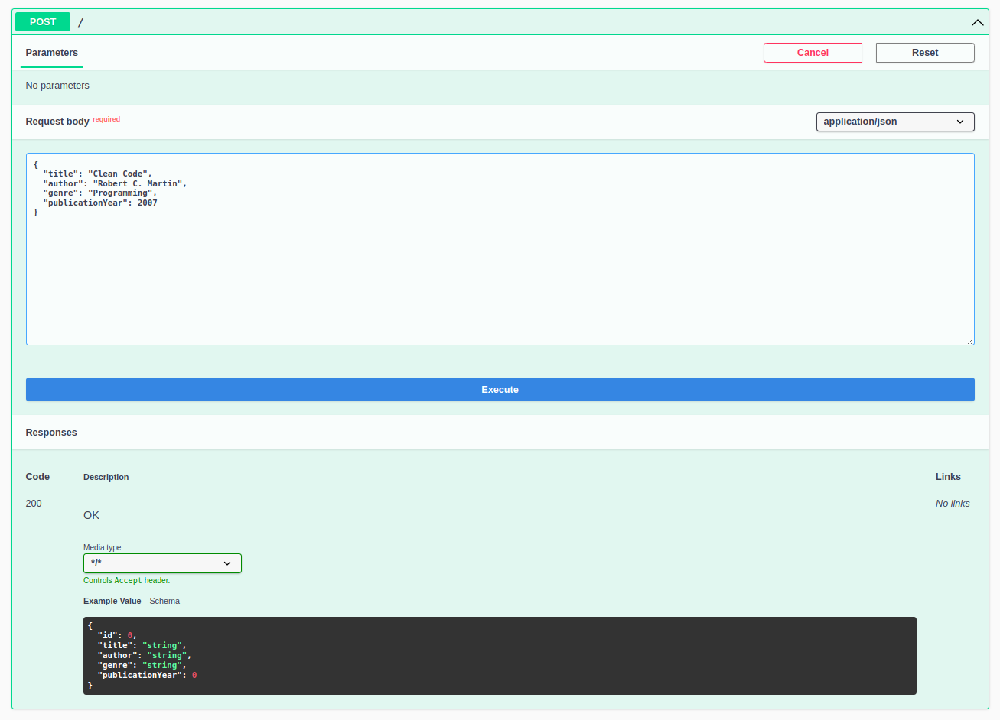

# 📚 Bookshelf Management

REST API for managing books on a *"virtual bookshelf"*

## Table of Contents

  * [📝 Features](#📝-features)
  * [👾 Demo](#👾-demo)
  * [❓ How to Use](#❓-how-to-use)
    * [✋ Prerequisites](#✋-prerequisites)
    * [🚀 Runnning](#🚀-running)
  * [🛠 Technologies](#🛠-technologies)
  * [🔖 Learnings](#🔖-learnings)

## 📝 Features

- [x] Display the list of books on the bookshelf
- [x] Add a new book to the bookshelf
- [x] Update the details of an existing book
- [x] Delete a book from the bookshelf

## 👾 Demo




## ❓ How to Use

### ✋ Prerequisites

Before starting, you will need to have the following tools installed on your machine:
[Git](https://git-scm.com), [JDK 17](https://www.oracle.com/java/), [Maven](https://maven.apache.org/), [Postgres](https://www.postgresql.org/). 
Furthermore, it is good to have an editor to work with the code like [VSCode](https://code.visualstudio.com/)

### 🚀 Running

```bash
# Clone this repository
git clone https://github.com/alvesluis0/bookshelf-management

# Access the project folder in terminal/cmd
cd bookshelf-management

# Create a database and at the root of the project create a .env file with the following information:
DB_URL=your_database_url
DB_USERNAME=your_database_username
DB_PASSWORD=your_database_password
# For example
DB_URL=postgresql://localhost:5432/bookshelf_management
DB_USERNAME=alves
DB_PASSWORD=my_strong_password

# Install the application on Linux
bash manager.sh install
# Install the application on Windows(Powershell)
.\manager.ps1 install

# Run the application on Linux
bash manager.sh run
# Run the application on Windows(Powershell)
.\manager.ps1 run

# The server will start on port:8080 - access <http://localhost:8080/swagger-ui.html> to test
```

## 🛠 Technologies

The following tools were used to build the project:

- [Java 17](https://www.oracle.com/java/)
- [Maven](https://maven.apache.org/)
- [Spring Boot](https://spring.io/)
- [Postgres](https://www.postgresql.org/)

## 🔖 Learnings

- Connection to the Postgres database
- Document API with Swagger
- Management of environment variables
- Create Bash and Powershell scripts